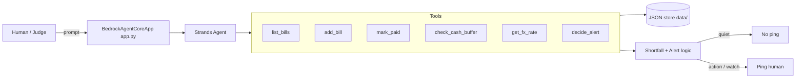

# Naira Pulse

**Background money agent for Nigeria** — tracks recurring bills, your NGN cash buffer, and USD/NGN FX. Stays quiet. **Only pings when you need to make a decision.**

Built for the **AWS Agents for Humans · Everyday Agents** hackathon with the **Strands Agents SDK** and **Amazon Bedrock AgentCore**.

[](LICENSE)

## Problem

Everyday Nigerians juggle clustered bills — **rent, DSTV, MTN data, generator fuel** — while the naira’s purchasing power and USD/NGN rate shift week to week. Dashboards and bank SMS create noise. What’s missing is a calm agent that watches the buffer in the background and interrupts only when a human choice is required (fund the buffer, defer a bill, or time a FX move).

## Who it’s for

- Salaried and hustle households managing life in **NGN**
- People who keep a small **USD buffer** and care when USD/NGN jumps
- Anyone tired of “your bill is due” spam who still can’t afford a missed rent transfer

## Why an agent (not another spreadsheet)

| Approach | Failure mode |
| --- | --- |
| Spreadsheet | You forget to open it |
| Bank push alerts | Notification fatigue → mute → miss the real one |
| **Naira Pulse** | Tools + thresholds → **quiet by default**, ping = decision |

## Architecture



See [docs/architecture.md](docs/architecture.md) for component details.

## Quick start (no AWS required)

```bash
git clone https://github.com/Quantumwoof/naira-pulse.git
cd naira-pulse
python -m venv .venv
source .venv/bin/activate   # Windows: .venv\Scripts\activate
pip install -r requirements.txt

# Offline demo — quiet run + alert run with sample bills
DEMO_MODE=1 python -m naira_pulse.demo

# Unit tests (pure logic, no LLM)
pytest -q
```

`DEMO_MODE=1` is the **default**. You do **not** need Bedrock credentials to judge the demo.

### Sample data

The demo seeds four everyday bills:

| Bill | Category | Role in story |
| --- | --- | --- |
| Rent | housing | Large, must-not-miss |
| DSTV | entertainment | Recurring subscription |
| MTN Data | telecom | Connectivity |
| Generator Fuel | energy | NEPA reality tax |

- **Quiet run:** buffer covers all upcoming bills → `should_ping=false`
- **Alert run:** thin buffer vs rent cluster → `level=action` shortfall ping

## Project layout

```
naira-pulse/
├── app.py                 # AgentCore entrypoint (BedrockAgentCoreApp)
├── naira_pulse/
│   ├── agent.py           # Strands agent + system prompt
│   ├── demo.py            # Offline quiet + alert demo
│   ├── logic/             # Shortfall + alert thresholds (tested)
│   ├── tools/             # list_bills, add_bill, mark_paid, ...
│   ├── store.py           # JSON persistence under data/
│   └── seed.py            # Sample Nigerian household data
├── data/                  # Runtime JSON store
├── docs/
│   ├── architecture.md
│   └── DEMO_SCRIPT.md     # ≤5 min video outline
├── tests/
├── requirements.txt
└── LICENSE
```

## AgentCore / Bedrock (optional)

```bash
export DEMO_MODE=0
export AWS_REGION=us-east-1
# credentials via normal AWS chain
python app.py
# POST /invocations  {"prompt": "Do I need to top up my buffer?"}
```

When `DEMO_MODE=1`, `app.py` still boots but returns a deterministic tool snapshot (handy for wiring checks without calling a model).

## Tools

| Tool | Purpose |
| --- | --- |
| `list_bills` | List unpaid (or all) bills |
| `add_bill` | Add a bill (name, ₦ amount, due date, …) |
| `mark_paid` | Mark a bill paid by id or name |
| `check_cash_buffer` | Read/update NGN buffer + shortfall report |
| `get_fx_rate` | Seeded USD/NGN quote (+ optional override) |
| `decide_alert` | Quiet / watch / action gate |

## Devpost pitch

### Inspiration

Rent day in Lagos doesn’t care that diesel went up and USD/NGN moved overnight. We wanted an **everyday agent** that respects attention: silence as a feature, interruption as a scarce resource.

### What it does

Naira Pulse tracks bills and your NGN cash buffer, peeks at USD/NGN, and runs deterministic thresholds. If you’re covered, it stays quiet. If you’re short — or FX moved enough to change a USD buffer decision — it pings with a clear reason.

### How we built it

- **Strands Agents SDK** for the tool-using agent
- **Bedrock AgentCore** (`BedrockAgentCoreApp`) as the deployable entrypoint
- Pure Python **shortfall + alert logic** covered by **pytest** (no LLM in CI)
- Offline **DEMO_MODE** so the story runs on a laptop with zero cloud setup

### Challenges

Calibrating “when to speak”: too chatty and it’s another notification app; too quiet and rent slips. Thresholds + imminent-bill rules were the hard product design, not the LLM glue.

### Accomplishments

- End-to-end quiet vs alert demo with real Nigerian bill archetypes
- AgentCore-ready `app.py`
- Tested decision logic judges can trust without AWS

### What we learned

Everyday agents win on **judgment about silence**. Tools and memory matter; so does refusing to talk.

### What’s next

- DynamoDB store + optional Open Banking / statement ingest
- Licensed FX feed + personal USD buffer goals
- WhatsApp / SMS delivery channel for action pings only

## License

MIT — see [LICENSE](LICENSE).

## Demo video script

See [docs/DEMO_SCRIPT.md](docs/DEMO_SCRIPT.md) (≤ 5 minutes).
